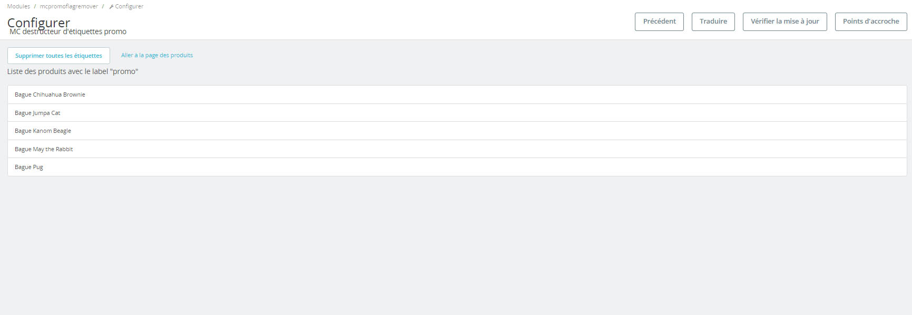

# mcpromoflagremover

This is a simple prestashop module to remove the labels "on_sale" from the active products. 
Prestashop 1.7 
<h3>Installation</h3>

Create a directory named "mcpromoflagremover" in the /module dir.  
Clone The repository then install the module via the backend

